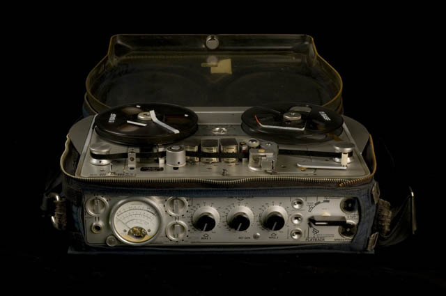

# 2\. Grabar audio

### 2\. Grabar audio

Grabar el contenido (música, voz o ambas cosas) con un programa de edición de audio.

Te proponemos trabajar con Audacity, es gratis y libre, está disponible para Windows, Mac, Linux. FreeBSD ([Descargar Audacity](http://audacity.sourceforge.net/))

Además del tutorial incluido en esta lección puedes consultar también:

*   En formato pdf: [http://www.jesusda.com/docs/ebooks/ebook_tutorial-edicion-de-sonido-con-audacity.pdf](http://www.jesusda.com/docs/ebooks/ebook_tutorial-edicion-de-sonido-con-audacity.pdf)
*   En formato multimedia: [http://www.juliomiro.com/auxiliar_foros/audacity.wmv](http://www.juliomiro.com/auxiliar_foros/audacity.wmv)

\[Imagen:  Esta foto, cuyo autor es [https://goo.gl/6g7CW7](https://goo.gl/6g7CW7) está bajo una [licencia de Reconocimiento-NoComercial-SinObraDerivada 4.0 Internacional de Creative Commons](http://creativecommons.org/licenses/by-nc-nd/4.0/).
