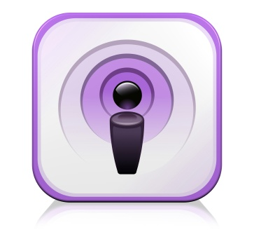

# 3\. Publicar

### **3\. Publicar**

Necesitamos subir el archivo a un servidor de Internet para que lo puedan escuchar nuestros oyentes y mediante el uso el protocolo HTTP puedan acceder a él (es decir, que se pueda escuchar o descargar como si fuera una página web o una imagen). 

Utilizaremos un servicio de alojamiento de podcasts (los tenéis más abajo) que hacen todo el proceso de forma sencilla y automática dándote una dirección del archivo mp3 y un RSS válido. 

**Servicios gratuitos de alojamiento de _Podcast_**

*   [Soundcloud](https://soundcloud.com)  (puedes consultar el tutorial en esta lección)
*   [Ivoox](http://www.ivoox.com/ "http://www.ivoox.com/")
*   [Archive.org](http://www.archive.org/)
*   [Podomatic](http://www.podomatic.com/directory "http://www.podomatic.com/directory")
*   [Blip](http://www.blip.tv/ "http://www.blip.tv/")
*   [Poderato](http://poderato.com/ "http://poderato.com/")
*   [Podcast.es](http://www.podcast.es/ "http://www.podcast.es/")
*   [Espaciopodcast](http://www.espaciopodcast.com/ "http://www.espaciopodcast.com/")

Para hacer uso de todos estos servicios, **sólo hay que crear una cuenta de usuario**, es decir, registrarse y comenzar a grabar con el micrófono o subir nuestros ficheros mp3.

\[Imagen:  Esta imagen, cuyo autor es [https://goo.gl/IIbVkg](https://goo.gl/IIbVkg) está bajo una [licencia de Reconocimiento-CompartirIgual 4.0 Internacional de Creative Commons](http://creativecommons.org/licenses/by-sa/4.0/).\]
