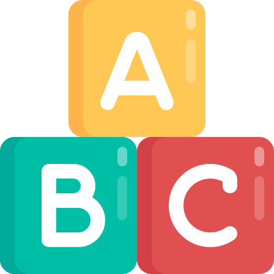

# Introducción

En la sociedad del conocimiento el cambio mediático y tecnológico, constante, obliga al aprendizaje permanente. Este debe realizarse, en la actualidad, utilizando no sólo el texto como elemento facilitador de la comunicación y, por tanto, del aprendizaje, también el lenguaje de la imagen, los medios y la tecnología que implica su lectura. Por otra parte se produce una interactividad, propiciada por la conectividad móvil especialmente, que hace necesaria la interpretación de múltiples lenguajes en una sociedad en red y global.

Conocer los distintos lenguajes, utilizarlos e interpretarlos requiere un esfuerzo necesario para tener una relación con nuestro alumnado. De ahí la importancia de trabajar en aulas creativas que utilicen el nuevo entorno mediático y los cambios comunicativos. Para ello se deben utilizar los recursos digitales a nuestra disposición. Las redes sociales y su complejo ecosistema de interacciones propician más que nunca el trabajo cooperativo en red, necesario para el cambio metodológico de nuestras aulas.

