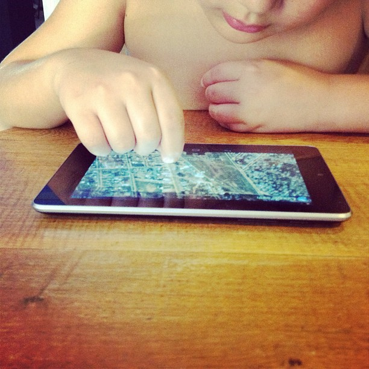

# Alfabetizar hoy

Como se ha podido observar a lo largo de los anteriores contenidos se hace necesario redefinir la alfabetización en su sentido tradicional entendida como enseñanza-aprendizaje dirigida a leer y escribir.

Actualmente, debemos sumar a estas habilidades las destrezas para comprender las funciones de los medios y otros proveedores de información y buscar, evaluar, utilizar y crear información.

Kelly, uno de los expertos del último informe de la OCLC (2011) enumera los seis nuevos verbos que se necesitan para considerarse un alfabeto digital:

*   **Leer en pantalla.** Nuestra cultura ha sido la cultura del libro, sin embargo nos estamos convirtiendo en seres pegados a pantallas que nos rodean continuamente. Este es el contexto en el que se van a publicar los nuevos contenidos.
*   **Interactuar**. Nuestras expectativas son las de interactuar con los contenidos intelectualmente, pero dentro de poco, tambien físicamente. Interactuamos con la voz, gestos, manos y de forma no lineal.
*   **Compartir**. Toda nuestra actividad mediática se vuelve social: lectura social y libros que se entrecruzan en bibliotecas compartidas.
*   **Acceder.** Ya no se habla de propiedad, el futuro de los media es el acceso y no su propiedad: ¿qué sentido tiene la propiedad cuando se puede acceder a la información en cualquier momento?
*   **Fluir.** Los datos circulan en streaming, sin parar. El paradigma de la página está llegando a su fin. En su lugar los relatos y la información se reconstruyen constantemente. Nos estamos moviendo de lo estático al permanente fluir, como ocurre con Twitter, las RSS feeds, los muros de Facebook, los blogs, la geolocalización, etcétera.
*   **Generar**. La generación de contenidos en distintos formatos y a través de nuevas vías y medios.

Textos extraído de:  [Alfabetización para una cultura social, digital, mediática y en red N.º Monográfico, 17-45, 2012. ISSN: 0210-0614.](http://redc.revistas.csic.es/index.php/redc/article/viewFile/743/824)

Terminamos este bloque con las palabras de Daniel Cassany en el I Congreso de Leer.es: "Cada día leemos de maneras más distintas porque leemos artefactos distintos para conseguir cosas distintas" 

Cambian los soportes, los textos, los usos y las prácticas de lectura; cambian las estrategias con que afrontamos la lectura de los textos. Estos cambios nos afectan a todos: niños, jóvenes y adultos.

Imagen de [Mercedes Kamijo](http://www.flickr.com/photos/69081753@N08/8424108080/in/photolist-dQpKQL-fBRsy5-v5m5U-v5iES-v5sga-dAQDmA-8m7txM-cYYosW-cYYan7-cYXXi9-cYZ5mE-boJAKC-4s2FrG-a89dkG), 2013, [CC BY-NC-SA 2.0](http://creativecommons.org/licenses/by-nc-sa/2.0/deed.en)