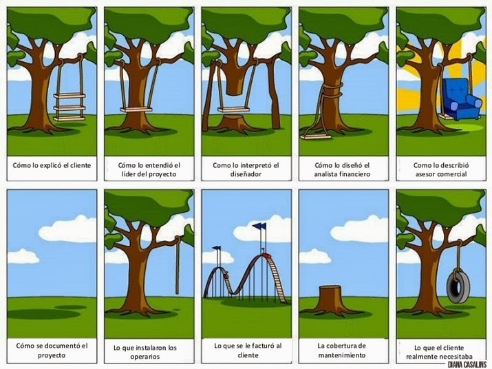

# Apartados del briefing

**No existe un _briefing_ estándar**. Puede decirse que cada anunciante crea su propia estructura. No obstante, los apartados más necesarios son:

**   1\. Descripción de la situación**

*   Producto (gama, características, etapa, condicionamientos legales...)
*   Marca (posicionamiento, notoriedad, proyección futura...)
*   Organización o empresa (cultura corporativa, evolución, etapa actual...)
*   Competencia (ranking de marcas y posicionamientos) 

**  2\. Antecedentes publicitarios**

*   Detalle de la/s campaña/s publicitaria/s y comunicativa/s anterior/es.

**  3\. Público objetivo:**

*   Perfil del público destinatario.
*   Actitud, motivaciones ante el producto.

**   4\. Objetivo publicitario**

*   Qué se quiere conseguir con la campaña.

**   5\. Beneficio y razón para creerlo**

*   Beneficio más persuasivo que ofrece el producto y razón principal para que el público pueda creer en ello.

El anunciante puede incluir un apartado sobre condiciones de ejecución en el que incluya el medio o medios (TV, prensa, cine...) que solicita para la difusión de la campaña, el presupuesto, el calendario de lanzamiento o cualquier otro aspecto.

En ocasiones con el _briefing_ se hace entrega de **anexos de información** que pueden facilitar a la agencia un análisis más completo y rápido de la situación de comunicación del anunciante.  
  
Una vez recibido este material, **la agencia analiza el _briefing_ (_desbriefing_**) identifica datos útiles que no aparecen, informaciones contradictorias y aspectos dudosos que, en muchos casos, motivan una segunda reunión con el cliente, conocida como **_contrabriefing_**. La asimilación de la información y la implicación en esta primera fase son decisivas ya que, al ser los primeros contactos, marcan la relación con el cliente e influyen en el grado de comprensión del problema que plantea.

\[Imagen: [http://multimediaintegral.blogspot.com.es/2013/11/brief-y-el-disenador.html](http://multimediaintegral.blogspot.com.es/2013/11/brief-y-el-disenador.html)\]