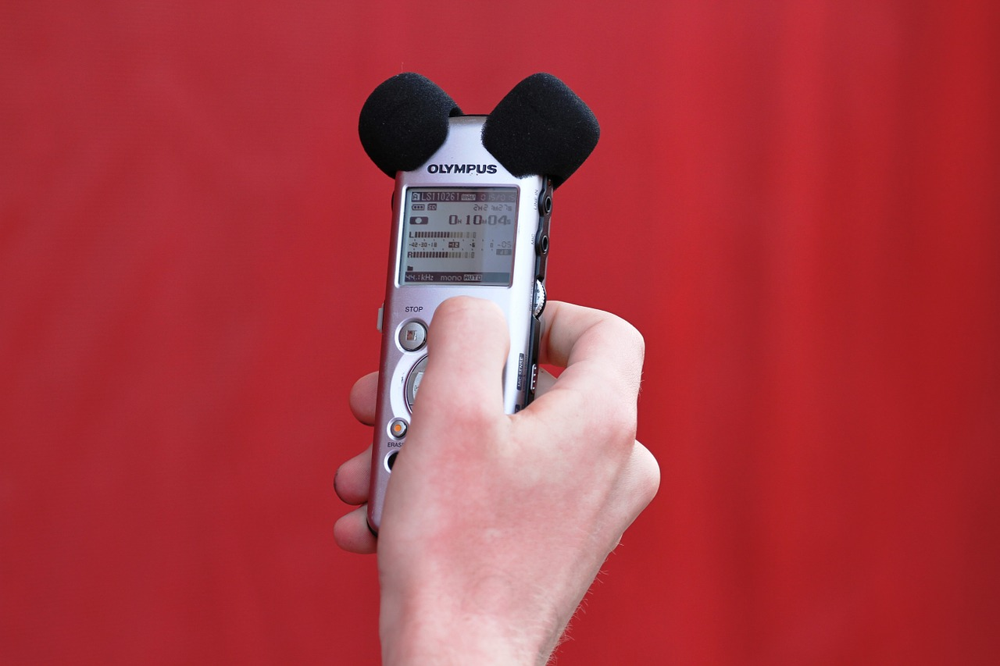

# Aspectos previos a la grabación de audio

A continuación se presentan algunos aspectos previos a la grabación de un audio, los cuales sin duda facilitarán el trabajo en las diferentes etapas.

*   #### ¿Qué deseo comunicar? (Mensaje)
    Definir el tema específico que pretende abordarse.

    
    
*   #### ¿A quién va dirigido el audio?
    Definir quiénes serán los oyentes potenciales del recurso sonoro. Se deben tener en cuenta cuáles son las necesidades, hábitos y preferencias de dicho público, lo cual más adelante ayudará a definir el tipo de recurso narrativo o montaje sonoro propicio para trabajar.
*   #### ¿Qué pretendo lograr?
    Definir unas metas claras para alcanzar, lógicamente, en relación con esas necesidades específicas (informar, formar, entretener, etc.) que deseamos cubrir.
*   #### ¿Cómo lo voy a comunicar? (Recursos narrativos) 
    El formato en que se comunique el mensaje (ficcionado o documentado) también hace parte integral de la sensación que se desea causar en el escucha.

Una vez definidos los aspectos anteriores, sigue la etapa del registro de audio; para ello es necesario escoger el dispositivo con el cuál se realizará el registro. Aunque en el mercado existen diferentes dispositivos electrónicos para registrar audio como los smartphones, tabletas, grabadoras de audio, entre otros, es importante revisar las características técnicas de dichos dispositivos en relación con el objetivo propuesto y la calidad que esperada. También se deben tener en cuenta el tipo de recursos sonoros a utilizar, los cuales estarán alineados con el objetivo del producto esperado. Entre ellos se encuentran los recursos musicales (cortinillas, fondos de acompañamiento, ráfagas, entre otros), voces (locuciones, vox pop, testimonios, conferencias, etc.), efectos de sonido y ambientes.

Fuente: Lenguaje y formato sonoro. [http://goo.gl/TNmzO1](http://goo.gl/TNmzO1)
