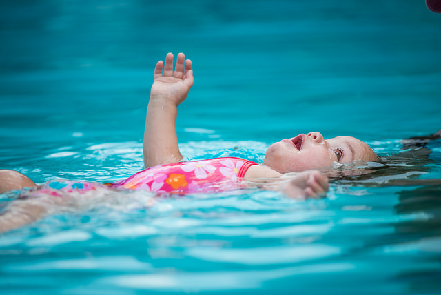

# b. El aprendizaje

El paradigma de educación que hemos heredado, define aprendizaje: la resultante de un proceso de estímulo-respuesta, en el que tiene un papel preponderante el esfuerzo individual, el estímulo de los textos y la acción de transmisión del docente sobre el alumno. Es decir, la relación docente-alumno debe ser directa, personal, y permanente.

Un sistema educativo orientado hacia las necesidades del siglo XXI debe entender el aprendizaje como _el resultado de la construcción activa del sujeto sobre el objeto de aprendizaje:_

*   Supone un aprendiz activo, que desarrolla hipótesis propias acerca de cómo funciona el mundo, que deben ser puestas a prueba permanentemente.
*   Supone la generación de operaciones mentales y procedimientos prácticos que permitan seguir aprendiendo solo, durante el tiempo de vida que está dentro del sistema educativo.
*   Supone que el maestro y el alumno exploran y aprenden juntos, pero que esta exploración y aprendizaje mutuo puede revestir diferentes formas, desde las más presenciales hasta las más remotas.

Imagen:   Esta foto cuyo autor es [https://goo.gl/wYtsGL](https://goo.gl/wYtsGL) está bajo una [licencia de Reconocimiento 4.0 Internacional de Creative Commons](http://creativecommons.org/licenses/by/4.0/).
