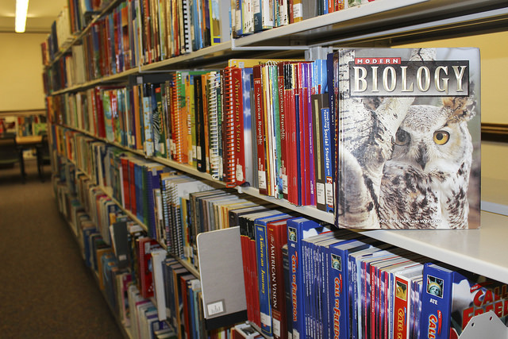

# c. Los contenidos

Finalmente, en el paradigma clásico de organización del sistema escolar se supone que lo que se debe enseñar, los ‘contenidos’, son ciertos elementos conceptuales de las disciplinas, que llegan a ser muchas veces sólo los datos descriptivos singulares (fechas, datos, nombres).

Un sistema educativo orientado hacia las necesidades del siglo XXI debe incorporar una definición de contenido de la enseñanza “mucho más amplia de lo que es habitual en las discusiones pedagógicas. En realidad, los _contenidos designan el conjunto de saberes o formas culturales cuya asimilación y apropiación por los alumnos y alumnas se considera esencial para su desarrollo y socialización.” _(Coll y otros, 1994). O sea que la escuela debe enseñar, por supuesto, todos los elementos conceptuales que el avance de la ciencia y las necesidades de resolver problemas determine pero, y con igual nivel de compromiso, es tarea del sistema escolar enseñar los procedimientos mentales que permitan actualizar los conceptos y aplicarlos a la realidad, y las actitudes y valores que entran en juego cuando dicha aplicación tiene lugar.

Las opciones que se toman en torno a qué definición de conocimiento, de aprendizaje y de contenido es válida para una sociedad, determinan desde los planes de estudio hasta la forma organizativa y las prácticas cotidianas concretas del sistema educativo: qué se enseña y en qué contexto organizacional se enseña. Por esto una transformación educativa, para ser estructural, debe proponer cambios fuertes en estos tres aspectos y no atender única, o básicamente, a uno de ellos sin ocuparse de manera sustantiva de los demás.

