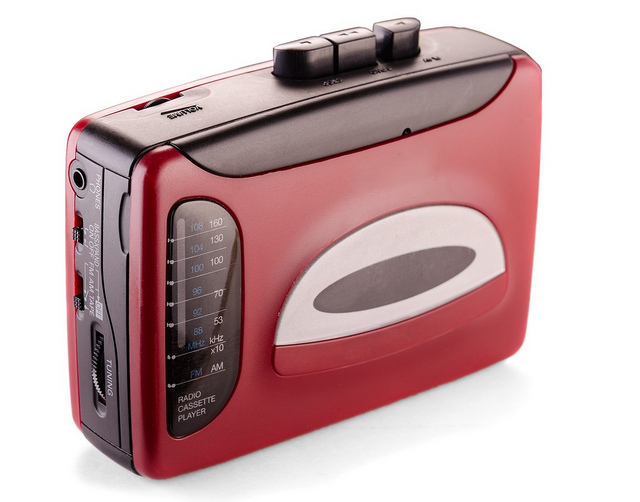

# Características generales del lenguaje sonoro

*   El lenguaje sonoro es **fugaz.** Dura exactamente el tiempo de emisión. Es instantáneo.
    
*   Es **huidizo. **No se lo puede retener para volver a escuchar o entender. La audiencia tiene poco poder de retención, por ello en la producción se recomienda la redundancia o repetición.
    
*   Es **rápido****.** Inmediato, la emisión es simultánea con la recepción1.
    
*   Es **económico**. El costo mensaje / receptor es más barato cuanto mayor sea la difusión.
    
*   **Amplitud de cobertura**. Tiene la posibilidad de llegar a muy diversos lugares al  mismo tiempo.
    
*   **Unisensorialidad**. Se recibe a través de un solo sentido (el oído).
    
*   **Bidireccionalidad.** Posibilita el diálogo entre el comunicador y la audiencia.
    

\[1\] Cuando grabamos algo, el momento de emisión es cuando ponemos PLAY, el momento de grabación recibe el nombre de REGISTRO

Imagen:  Esta foto, cuyo autor es [https://goo.gl/2NJA78](https://goo.gl/2NJA78) está bajo una [licencia de Reconocimiento-NoComercial 4.0 Internacional de Creative Commons](http://creativecommons.org/licenses/by-nc/4.0/).

Fuente: PROVENSAL, Analía. "El sonido en una producción multimedia" La trama de la comunicación. Vol.9. Rosario, Argentina. UNR editora 2004