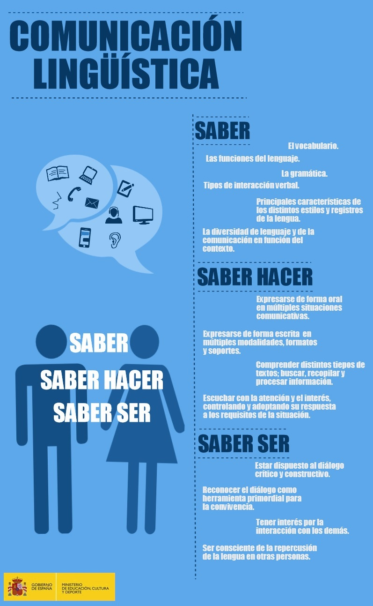

# Comunicación lingüística

Eligiendo, compartiendo y conectando desarrollamos competencias que permiten al alumno tomar decisiones conscientes, comprender e interpretar los textos, aprehender su contenido y poder reelaborarlo. Competencias básicas y tradicionales puestas al día en un contexto de lectura que contempla todos los soportes, canales y tipos de texto y que se plantea como llave del conocimiento en la sociedad de la información.

Especial relevancia tiene el desarrollo de la competencia referida a la habilidad para utilizar la lengua, expresar ideas e interactuar con otras personas de manera oral o escrita. 

"La tarea de los docentes no es animar con frases acertadas a que los alumnos cojan libros, sino enseñar a leer para que en cualquier circunstancia la competencia lectora los ponga en contacto con el mundo y los dote de recursos para desenvolverse. De eso se trata. Que además se promocione la lectura está muy bien, pero hacer de la animación a la lectura el fin último de un Plan Lector es perder una oportunidad y resulta un esfuerzo que no logra la profundidad requerida". - _María Jesús Cruz Gimeno, Asesora de Competencia Lingüística de la Dirección General de Política Educativa y Educación Permanente_, [La lectura al amparo de la LOMCE: el plan lector](http://127.0.0.1:51235/Espacios_lectura_15_B3_compartir/resources/LaLecturaAlAmparoDeLaLOMCE.pdf).

Todos somos profesores de competencia lingüística, y esto no quita tiempo a nuestras áreas, sino que mejora su aprendizaje. Cada área puede trabajar tipologías textuales diferentes, según sus características. Cada departamento puede elegir su grado de implicación siempre que se asuman unos mínimos consensuados.

La competencia lingüística abarca:

*   Competencia lectora
*   Competencia para hablar y escuchar
*   Competencia en composición de textos
*   Competencia plurilingüe y pluricultural (PLC)

