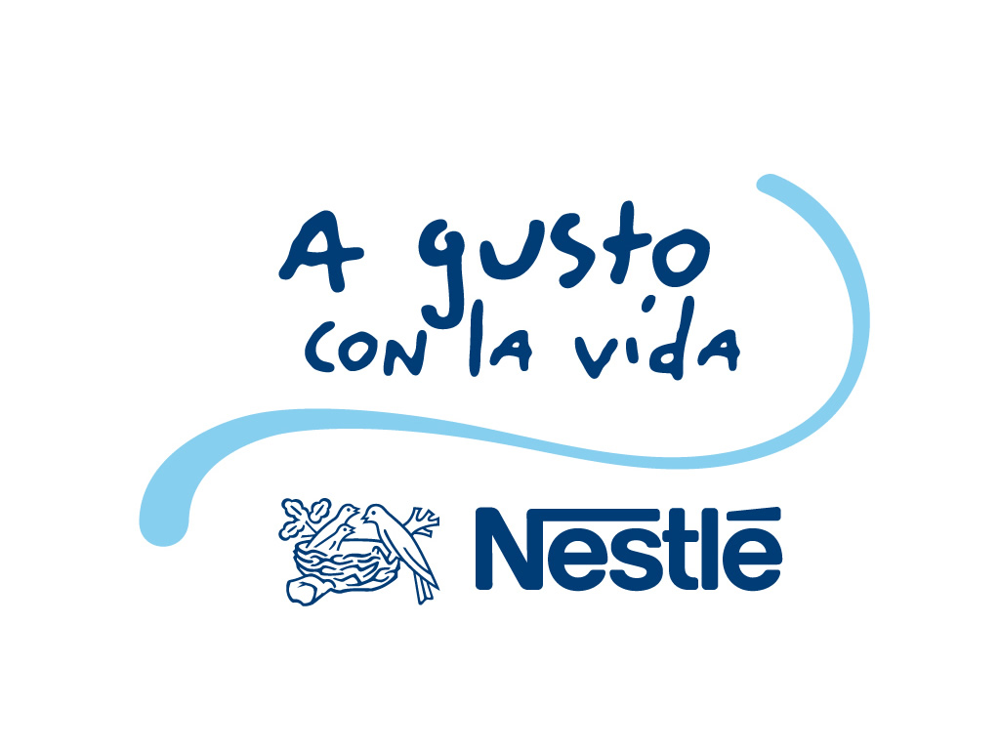

# Consejos para hacer un buen eslogan

1.  Un eslogan tiene que poder insertarse fácilmente en la conversación cotidiana. No es obligatorio que lo haga, pero sí recomendable. Frases como “Es de sabios cambiar de opinión”, pueden ser usadas para redactar un grito de guerra fácil de recordar. Aquí, algunos ejercicios: “Los conocedores cambian a X”, “La marca de los expertos”, “Adaptándonos al mundo”.

2.  Un eslogan tiene que empezar con un verbo o con un imperativo. Esto le da al eslogan dinamismo, movimiento, y además, incita a la acción. Ejemplos: “Haz”, “Come”, “Vuela”, “Sueña”, “Sé”, etcétera.
3.  Un eslogan tiene que describir el giro de la empresa cuando el nombre de la empresa no lo hace. Ejemplos: “Grupo Truhán, resolviendo problemas legales desde 1580″
4.  Un eslogan, antes, no tenía que superar las ocho palabras, el diálogo se ha acortado, tanto, que ahora sólo alcanza las tres o las cinco palabras.
5.  Usa pocas palabras con muchas sílabas o muchas palabras con pocas sílabas. Es recomendable, para fines memorísticos, que un eslogan contenga pocas palabras con pocas sílabas. Pero la verdad es que es muy complicado lograr un eslogan así, uno que se memorice con velocidad. En vez de decir “Modernamente memoriales”, podemos decir: “Desde siempre modernos”. 
6.  Un eslogan tiene que facilitar nuestra pronunciación.
7.  Un eslogan, preferentemente, debe usar palabras concretas y evitar las abstracciones. No digamos “Sueños e ilusiones de belleza”. Mejor, mejor digamos: “Hacemos de tus ojos un ensueño”.
8.  Un eslogan no es un concepto creativo, sino una firma que acompaña al logotipo. Un eslogan no es un texto o un argumento publicitario, sino una conclusión. Un eslogan no es un Padre Nuestro, sino un Amén, algo que perdura (“verba volant, scripta manent” (las palabras vuelan, lo escrito queda)).
9.  Al hacer un eslogan debemos evitar las metáforas baratas, los proverbios baratos, y abominar de las metáforas agropecuarias, bancarias o militares. Olvidemos el “con los pies en la tierra”, el “cosecha lo que siembras” o el “el sol sale para todos”. Estas frases, trilladas, no le dicen nada el consumidor metropolitano. Las mejores metáforas son las deportivas.
10.  No redactes, en el proceso de la lluvia de ideas, frases sueltas. Redacta párrafos, largas tiradas de pensamientos (como lo hacían los dadaístas y demás “ístas”), pues de ahí saldrá un eslogan que contenga todos los puntos anteriores.