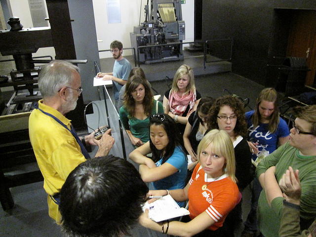

# De los saberes a las competencias

El nuevo paradigma implica cambiar básicamente la ecuación conocimiento -->docente --> alumno, pasando de los _saberes_ a las _competencias._ Esto solo será posible si tomamos conciencia, rediscutimos y redefinimos los ejes básicos que subyacen al actual modelo de educación (Aguerrondo, 1993).

Aunque existen elementos que permiten atisbar algunas redefiniciones, éstos no han crecido todavía lo suficiente ni están lo suficientemente sistematizados y organizados, como para plasmarse en decisiones que afecten medularmente a los sistemas educativos. Las decisiones se toman, todavía, desde las miradas retrospectivas del futuro. Frente a la crisis del paradigma clásico no se vislumbran respuestas alternativas. Son propuestas de ‘reforma’ y no de transformación estructural.

Podríamos decir que un sistema educativo se organiza en torno a tres grandes definiciones:

*   qué se entiende por _conocimiento_,
*   qué se entiende por _aprendizaje_, y
*   qué se entiende por _contenido_ de la educación.

Un cambio de paradigma educativo consiste básicamente en que, a partir de nuevas opciones político-ideológicas, una sociedad sea capaz de redefinir qué entiende por cada uno de estos ejes subyacentes o principios básicos que estructuran el sistema educativo.

Los sistemas educativos actuales, nacidos como consecuencia de la industrialización, se encuentran organizados sobre la base de las definiciones de ciencia (conocimiento), de aprendizaje y de contenidos vigentes en el momento en que se generaron. Para cumplir con este objetivo se desarrollaron instituciones (las escuelas y los sistemas escolares) cuyos ejes organizadores son _definiciones pedagógicas_ que postulan cómo garantizar que una serie de _conocimientos válidos_ sean _aprendidos_ por toda la población.

La definición de estos supuestos es importante porque determina la forma concreta de organización de la propuesta de enseñanza, o sea los elementos materiales específicos que deben existir para que se lleve adelante el proceso de aprendizaje, y por lo tanto los insumos materiales y los recursos humanos para ello.

Imagen:   Esta foto cuyo autor es [https://goo.gl/e6Tktc](https://goo.gl/e6Tktc) está bajo una [licencia de Reconocimiento-CompartirIgual 4.0 Internacional de Creative Commons](http://creativecommons.org/licenses/by-sa/4.0/).
