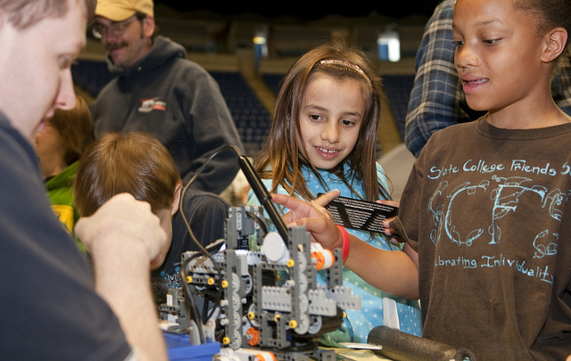

# Educar en valores

Las escuelas tienen que enseñar valores, moral y ética. Teniendo en cuenta la velocidad de los cambios en el desarrollo en áreas como tecnología, tratamientos médicos y tendencias; la educación, hoy más que nunca, debe construir una sólida base de respeto, empatía, compasión y responsabilidad hacia los demás, así como para el medio ambiente, la naturaleza y la convivencia humana.

Las escuelas tienen que desarrollar la empatía en los estudiantes. El nuevo mundo es más diverso y cosmopolita. El individuo de hoy debe interactuar con personas de todo el mundo, con diferentes orígenes, religiones, creencias, perspectivas y puntos de vista. La tolerancia y la empatía será la clave para construir relaciones comerciales y personales. En un mundo de conectividad y tecnología, la empatía del ser humano hace la diferencia.

