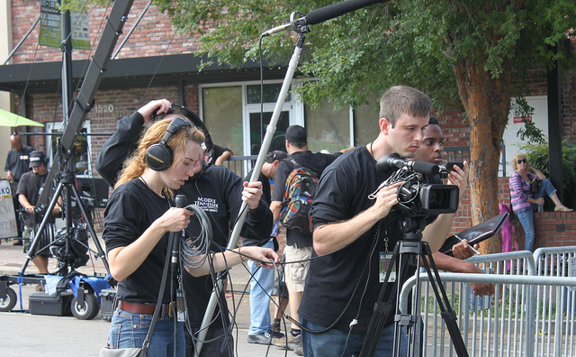

# El análisis y la comprensión

La construcción de una mirada crítica apuntada en el punto anterior sólo es posible conseguirla si se realiza un análisis en profundidad de los productos mediáticos que se consume. A partir de esta labor es como se puede llegar a estructurar una comprensión de los porqués que rodean la producción y los contenidos de estos mensajes, teniendo en cuenta también cuál es el canal que utilizan para difundirse. 

Cualquier mensaje de un medio de comunicación se puede llegar a analizar para descifrar todo lo que lleva consigo, ya sea explícita o implícitamente. Pero siempre se obtendrá un mayor resultado si se siguen unas pautas de análisis. Este patrón debe variar, lógicamente, según sea la categoría del mensaje a analizar. Así, se planteará de forma diferente la labor si se trata de analizar un anuncio, una noticia, un programa de entretenimiento.

Entre las muchas propuestas didácticas existentes, aquí destacamos las que propone el Grupo Spectus (2004) para analizar críticamente y generar una comprensión crítica:

*   Cómo los medios lanzan y potencian el conocimiento de un determinado producto.
*   El papel de los medios como transmisores de noticias.
*   El componente emocional de los mensajes mediáticos y cómo los medios se sirven de él para atraer a un determinado público.
*   La organización y dinámica empresarial que existen detrás de los diferentes grupos de comunicación que conocemos, y sus intereses en otras empresas vinculadas o no a los medios.

La comprensión de los mensajes mediáticos y todo lo que conllevan es necesaria para construir una ciudadanía activa y crítica en todos los ámbitos sociales, ya sean políticos, económicos, culturales o de cualquier otra índole. Después de un análisis en profundidad, en una democracia que se precie y evolucione es imposible tener una sociedad adormecida que se cree, a pies juntillas, todo lo que oye, lee o ve en los medios de comunicación. 

Imagen:   Esta foto, cuyo autor es [https://goo.gl/Mwxvbo](https://goo.gl/Mwxvbo) está bajo una [licencia de Reconocimiento-NoComercial 4.0 Internacional de Creative Commons](http://creativecommons.org/licenses/by-nc/4.0/).
