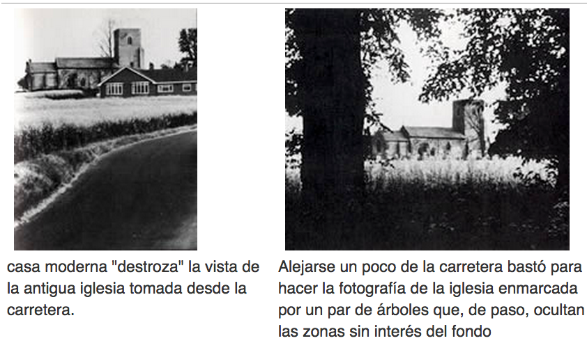

# El centro de atención

Mediante la fotografía, el estudiante puede expresar sus emociones, ideas y sentimientos, observando de su entorno. Cuanto más complicado sea lo que estemos observando, más importante será determinar un punto de vista y un ángulo que clarifiquen la imagen e ilustren exactamente lo que se pretende. Cada vez que se hace una fotografía hay que preguntarse qué es lo que se quiere decir y analizar estas intenciones conscientemente en lugar de dejarlas a merced del azar o de la intuición. Por ejemplo, al inclinar la cámara hacia abajo y hacer la toma desde este punto desaparece cualquier fondo inconveniente o se elimina el primer plano. Ensaye un ángulo diferente. Sea creativo. Agáchese y vea al sujeto de una nueva forma, tómese su tiempo para encontrar el mejor ángulo.  
Decida si hay elementos irrelevantes, distractores, excluibles o disimulables, desde otra posición. Probando varios puntos de toma es fácil darse cuenta de que se puede llegar al fondo de la esencia del sujeto. La reflexión crítica sobre lo que se ve es una parte vital del proceso de exploración.   
Por otra parte, es fácil olvidar la importancia que tienen ciertos detalles a la hora de contextualizar y establecer una escala de tamaños en una fotografía, lo que exige concentrarse en el visor para no dejar fuera nada importante. Así, el tamaño del sujeto sólo será obvio si en la imagen se incluye algo de tamaño conocido con que compararlo, como una persona.

Fuente: John Hedgecoe, (2003, Enero 25), Bases de la fotografía; EDUTEKA, Edición 16, Descargado: de [http://www.eduteka.org/ComposicionFotos.ph](http://www.eduteka.org/ComposicionFotos.php)