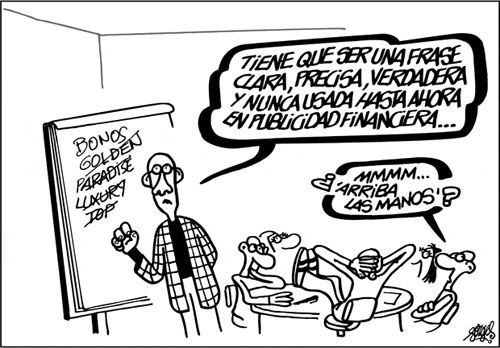

# El lenguaje de la publicidad

El lenguaje de la publicidad es el lenguaje del deseo, de la persuasión, de la seducción. En sus mensajes trata de reflejar lo que quisiéramos ser o tener. Para ello utiliza diversos recursos verbales, icónicos y musicales que configuran un texto pragmático cuya eficacia consiste en hacernos una gran promesa.

