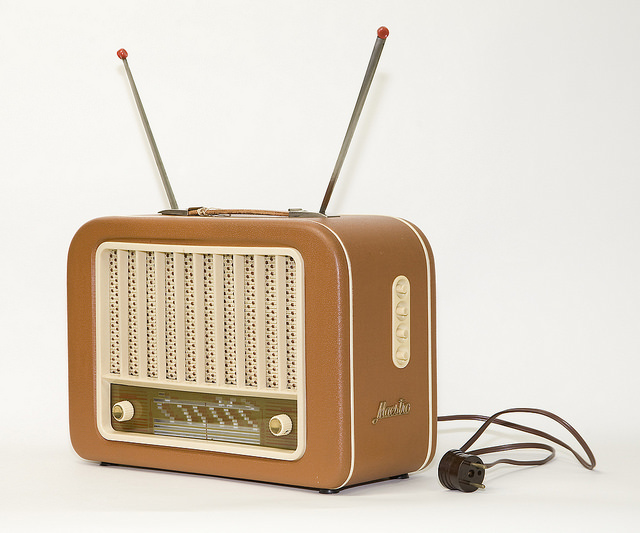

# El lenguaje radiofónico

Sin la existencia de un lenguaje y sin la existencia de un código o conjunto de normas y reglas que den sentido a ese lenguaje, difícilmente podríamos hablar de comunicación, de la misma manera que tampoco sería posible entablarla si no se dispone de un canal que la haga viable, si no se da una situación que la propicie -por mucho que deseemos conversar con alguien, raramente lo podremos hacer si no tenemos interlocutor-, o si no hay mensaje alguno que transmitir.  
  

En la radio, al igual que en los otros medios, convergen todas y cada una de las condiciones necesarias para hacer de la comunicación una realidad, ya que, entre otras cosas, tiene un lenguaje y un código específicos de los que se sirven sus profesionales para construir toda esa amalgama de mensajes/sonido que llegan a nuestros oídos a través de los aparatos receptores.   

  
De hecho, si ahora sintonizases una emisora de radio te darías cuenta de que constantemente se van sucediendo y alternando voces y músicas, y, en algunos casos, otros sonidos como el cantar de los pájaros en un anuncio sobre un balneario situado en plena naturaleza, o el de un motor y un claxon en un anuncio de coches. Observarías, igualmente, que todo está perfectamente ordenado y que, por ejemplo, una voz aparece cuando ha callado otra, que un fragmento musical que emerge al inicio de un informativo desaparece lentamente, que un locutor presenta una canción mientras suenan, a un volumen más bajo, las primeras frases de la música, y así un largo etcétera.   
  
Los componentes del lenguaje radiofónico, o, dicho de otro modo, las materias primas con las que trabaja la radio son cuatro:_ la voz_ (o el lenguaje de los humanos),_ la música_ (o el lenguaje de las sensaciones),_ los efectos sonoros_ (o el lenguaje de las cosas) _y el silencio_. Como es lógico, el uso que se hace de estas materias varía en función del tipo de programa y, así, mientras que en un informativo predominan las voces de aquellos redactores/locutores que relatan las noticias, en una radiofórmula musical es precisamente la música la que tiene un papel protagonista.  
  
El principal denominador común de los componentes del lenguaje radiofónico es, ante todo, su ilimitada riqueza expresiva y su gran poder de sugestión. Utilizando sólo la voz, o sólo la música, o la voz y la música, o la voz y el silencio, o todas las materias primas a la vez, podemos lograr que el oyente se alegre o se ponga triste, que visualice en su mente un paisaje, que recree un movimiento, que sienta miedo, que se entretenga o que se aburra... Porque, en el universo radiofónico, todo es posible.   
  

Fuente: [http://recursos.cnice.mec.es/media/radio/bloque2/pag4.html](http://recursos.cnice.mec.es/media/radio/bloque2/pag4.html)

\[Imagen:  Esta foto, cuyo autor es [https://goo.gl/W5wqey](https://goo.gl/W5wqey) está bajo una [licencia de Reconocimiento 4.0 Internacional de Creative Commons](http://creativecommons.org/licenses/by/4.0/).\]
