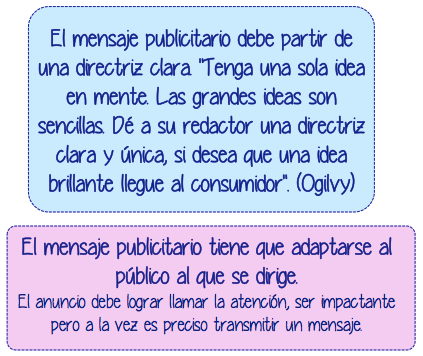

# El mensaje publicitario

La creación del mensaje publicitario parte de la personalidad decidida para el producto, los objetivos fijados, el lugar en el mercado que queremos dar al producto y el público objetivo al que nos dirigimos.

El mensaje publicitario se fundamenta en varios puntos claves:

*   “**Beneficio**” clave al consumidor. Por qué el consumidor deberá comprar su producto.
*   **Apoyo**. Una razón para creer en ese beneficio.
*   **El estilo**. El tipo de comunicación que deseamos para nuestra publicidad. 

Nos tenemos que preguntar: ¿Por qué el consumidor debe comprar nuestro producto y no el de la competencia? ¿Qué le podemos explicar para que compre?

La estrategia creativa debe adaptarse al plan de marketing de la empresa. El mensaje publicitario exige una cierta creatividad que está marcada por nuestra estrategia de comunicación. Debe existir una gestión conjunta del producto, el precio, la distribución y la publicidad. 

Y es preciso que el mensaje se recuerde. Debe ser memorable y quedar grabado en la mente del consumidor. 

https://www.youtube.com/watch?v=YxN6O2230sU

Por ejemplo la marca Calvo paso de ser desconocida a líder del mercado de latas de atún mediante unos anuncios en los que dos actores con poco pelo repetían muchas veces "Atún Claro Calvo".