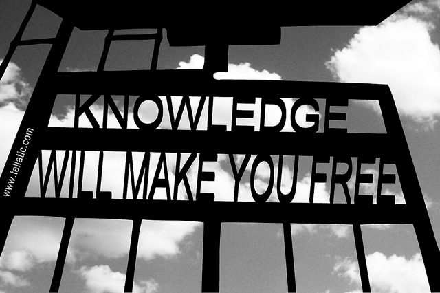

# El nuevo paradigma de la educación para el siglo XXI

Un rasgo indudable de esta nueva era es la importancia sin precedentes que adquiere el saber científico tecnológico. Son claras las tendencias que indican que ingresamos en la “era del conocimiento”. Como dicen los Toffler: “Todos los sistemas económicos descansan sobre una ‘base de conocimientos.’ Todas las empresas dependen de la existencia previa de este recurso, de construcción social. A diferencia del capital, el trabajo y la tierra, aquél suele ser desdeñado por economistas y ejecutivos cuando determinan las aportaciones precisas para la producción. Y, sin embargo, este recurso es el más importante de todos.” (Toffler, 1995)

Es el más importante porque es el más humano. Porque sólo conoce (aprende) el ser humano, pero también porque “el conocimiento tiene virtudes intrínsecamente democráticas. A diferencia de las fuentes de poder tradicionales (la fuerza, el dinero, la tierra) el conocimiento es infinitamente ampliable. Su utilización no lo desgasta sino que, al contrario, puede producir más conocimiento. Un mismo conocimiento, puede ser utilizado por muchas personas y su producción exige creatividad, libertad de circulación, intercambios, críticas constructivas, diálogo. Todas ellas condiciones propias de una sociedad democrática” (Tedesco, 1995)

Una “sociedad del conocimiento” se perfila, entonces, como una forma social superadora de las actuales, a condición de que el conocimiento -que es la base- sea un bien que está disponible para todos. Esta es la nueva sociedad. Mucho conocimiento al alcance de todos, distribuido de tal manera que garantice igualdad de oportunidades.

¿Cómo se logra? A través de un sistema escolar que sea el encargado de garantizarlo, al cual toda la sociedad le dé no solamente el mandato de hacerlo, sino también los recursos para lograrlo.

*   De las reformas a la transformación: necesidad de un nuevo paradigma
*   De los saberes a las competencias
*   Una nueva competencia: el saber tecnológico

Fuente de la Imagen:  [https://goo.gl/NiA4NG](https://goo.gl/NiA4NG)  está bajo una [licencia de Reconocimiento 4.0 Internacional de Creative Commons](http://creativecommons.org/licenses/by/4.0/).    

  

**Artículo completo:**

**El Nuevo Paradigma de la Educación para el siglo XXI: **[**http://www.oei.es/administracion/aguerrondo.htm**](http://www.oei.es/administracion/aguerrondo.htm)