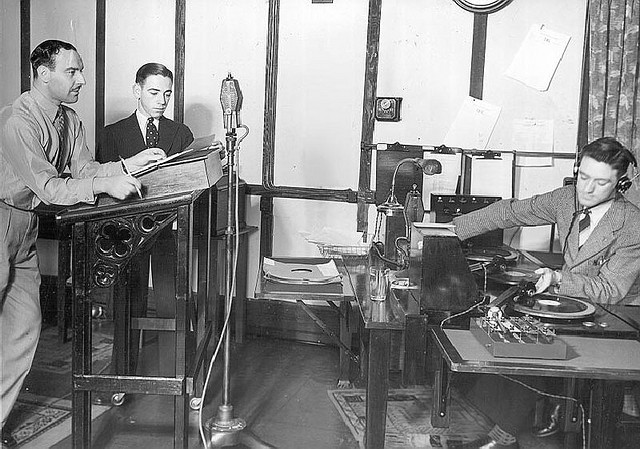

# El ruido: efectos sonoros y ambiente

Al igual que ocurre con la música, un ruido ambiente puede trasladarnos hasta una playa paradisíaca, por ejemplo.... Lo mismo podemos conseguir con algunos efectos sonoros, aunque, éstos en algunos casos nos ayudarán a describir las acciones que realizan los personajes.

*   **Función ambiental. **En este caso, el ruido nos ayuda a situar a los personajes en la escena. En la siguiente escena podemos situar a dos jóvenes en la calle, gracias al ambiente de tráfico.

*   **Función expresiva.** Se trata de crear una sensación con la utilización de ambientes y efectos. Por ejemplo, un constante parloteo de fondo, con ordenadores, teléfonos sonando... creará una sensación de estrés, que nos ayudará a sentir la sensación de angustia que vive el personaje.

*   **Función narrativa.** En este caso, los efectos sonoros que utilizamos, cobran vida por sí mismos, para mostrarnos el paso del tiempo, o acciones que está realizando el personaje. Por ejemplo: _Juan terminó su jornada laboral... seguidamente podemos poner efectos de pasos bajando la escalera, puerta de un edificio que se abre y cierra, más pasos, puerta del coche que se abre y se cierra, un suspiro, y una llave que arranca el coche. Con todo ello nos ahorramos el tener que contar como sale de la oficina y coge el coche hasta casa._

_

Fuente: El lenguaje sonoro: recursos y planos sonoros. [http://goo.gl/kTJL0X](http://goo.gl/kTJL0X) 

