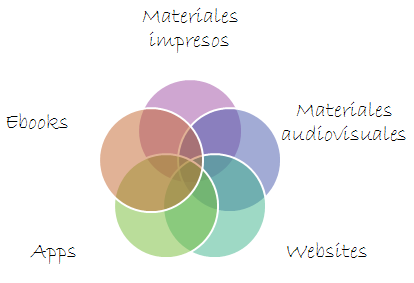

# Elegir

En el contexto de la lectura actual, la información se nos presenta en diferentes formatos:

Haciendo un pequeño análisis de los materiales en relación a la práctica lectora, encontramos:

Las **obras de ficción y de no ficción para niños y jóvenes** se presentan hoy en diferentes formatos, aunque el impreso sigue siendo aún mayoritario.

La **narrativa** es el género que cuenta con una mayor producción en el panorama editorial. La **poesía** y el **[teatro](http://www.lecturalab.org/story/Consejos-a-la-hora-de-elegir-una-historia-para-representar_2065)** son géneros más minoritarios en la producción actual para niños y jóvenes.

El **[álbum](http://www.lecturalab.org/story/Cmo-elegir-un-lbum-para-los-ms-pequeos_2244 "Cómo elegir un álbum para lo más pequeños")** es una tipología muy interesante, principalmente dirigida a los más pequeños, pero no solo a ellos. El **cómic** es otro tipo de libros ilustrados que, como los álbumes, presenta una narrativa secuencial. Para los más pequeños no existe una clara producción de cómic, pero sí obras que utilizan elementos característicos.

En cuanto a las **[obras de no ficción](http://www.lecturalab.org/story/Pautas-para-elegir-bien-libros-de-no-ficcin-documentales_1756 "Pautas para elegir bien libros de no ficción (documentales)")**, el abanico de fuentes informativas es muy amplio, adaptadas a las necesidades y a los conocimientos de los lectores en función de su edad.

Todo ello disponible en formato impreso, pero también [en **formato audiovisual y en línea**](http://www.lecturalab.org/story/Pautas-para-valorar-obras-multimedia-y-recursos-en-internet_2131 " Pautas para valorar obras multimedia y recursos en internet").

En este sentido, el auge y la rápida expansión de dispositivos móviles como los _smartphones_ y las tabletas, y su consideración como un instrumento didáctico versátil, han puesto en un primer plano de la actualidad el variado mundo de las aplicaciones. Los cambios en la tecnología y la concepción de los diseños interactivos de los materiales han facilitado el desarrollo de propuestas especialmente dinámicas:

*   El texto ha ido perdiendo importancia a favor de la imagen y el sonido.
*   El protagonismo del medio audiovisual es tan grande que la necesidad de grafismo desaparece completamente.
*   El discurso gráfico continuo se va transformando a lo largo del tiempo.
*   El diseño interactivo, como proceso creativo intrínseco, diferencia a los productos multimedia.

Aún así, continúan creándose muchos materiales que mantienen una concepción basada en las publicaciones impresas.

**¿Qué elementos se han de valorar en la selección de una lectura?**   
  
Estas y otras preguntas están presentes cuando nos ponemos a valorar una lectura:

*   La _calidad_: ¿qué es una buena lectura?
*   Los _valores_: ¿qué aporta al lector? Valorar la adecuación al destinatario, tanto en su contenido como en la forma, y el grado de interactividad que ofrece.
*   El _itinerario de aprendizajes que ofrece_: ¿en qué sentido contribuye a la formación del lector?
*   La _relación entre el texto y otros elementos_: la imagen, el sonido, vídeos, enlaces internos y externos,...
*   La _opinión de los lectores_: ¿qué les gusta?
*   Los _Responsables y propósito_: ¿quién está detrás de sus contenidos? ¿cuál es la intención del recurso?
*   La _Estructura y organización_: Distribución de contenidos, Navegación por secciones: botones, páginas de datos, enlaces, etc.

  

Cierto es que no hay una receta para determinar cuáles son las propuestas recomendables y cuáles no, cada una es un material particular y original a los ojos del mediador, que ha de determinar qué elementos considerar con el objetivo de orientar al lector (niño, joven, etc.) para apoyarlo en el acto de selección, que se realiza en función de cuestiones más específicas (gustos e intereses personales, objetivos curriculares, programas de didácticos, etc.).