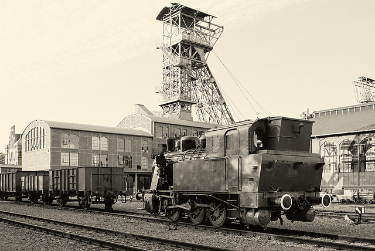

# Era industrial

La Revolución Industrial se inició con el desarrollo económico en Inglaterra en el siglo XVIII, lo que provocó cambios profundos en la vida política, social y cultural. Sus características  

fundamentales fueron el aumento el poder del capitalismo, el desarrollo del sector fabril, el progreso tecnológico y la aplicación de la energía a la industria.

El motivo por el que la Revolución Industrial se originó desde Inglaterra fue la Revolución Comercial, el sólido sistema monetario, la movilidad social y el fuerte abastecimiento de carbón.

La expansión de la Revolución Industrial se extendió a Bélgica, Europa Central, Rusia, América y Asia.

Las consecuencias de la Revolución Industrial fueron la formación de la gran industria, el neocolonialismo, la formación de la clase capitalista, el surgimiento del proletariado, la aparición de nuevas doctrinas sociales y el crecimiento de las clases y su poder.

Fuente de la imagen:[ https://goo.gl/3rsk9d](https://goo.gl/3rsk9d)     

  
         

**EDUCACIÓN EN LA ERA DIGITAL**

Siempre hemos construido el modelo educativo tomando como referencia las necesidades de la sociedad.

En la era industrial, las escuelas fueron diseñadas como motores económicos para abastecer de profesionales a una sociedad industrial, basada en la producción y el consumo masivo.

El sistema educativo asumió los valores típicos de la organización industrial: la jerarquía, la planificación, el control y la estandarización.

En esencia, se formaba a los jóvenes para que hiciesen lo que se les mandaba. Pasaban varios años memorizando el mayor cuerpo posible de conocimientos para explotarlo después, a lo largo de su etapa profesional.

Crítica a la escuela en el contexto de la sociedad industrial (fragmento de la película "La educación prohibida")

\[Historia de la escuela. Url: [https://www.youtube.com/watch?v=VHKGEI-q4wk](https://www.youtube.com/watch?v=VHKGEI-q4wk)\]