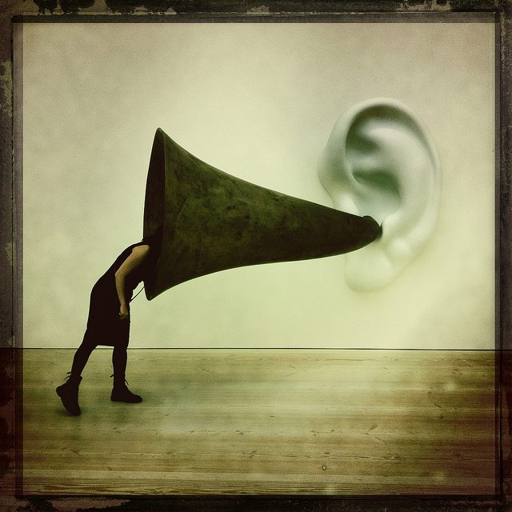

# Factores de percepción del lenguaje sonoro

El acto de percibir en el lenguaje sonoro es un acto de **imaginar**. La imaginación es un sentido interno que nos permite evocar y reproducir las impresiones sensoriales y perceptivas en ausencia de los objetos. Conformamos una imagen del objeto o la realidad a partir de la percepción totalizante y sensible.

El oyente construye la imagen de la realidad a partir del paisaje sonoro percibido: se forma una **imagen auditiva**. Esta imagen auditiva es el resultado de relacionar el conocimiento previo, experiencia, o memoria de la realidad que el oyente tiene de antemano, con el nuevo paisaje u objeto sonoro que percibe. La **memoria** es la que permite reconstruir la imagen de los objetos a partir de las nuevas percepciones sonoras, permite asociar el pasado a la nueva realidad comunicativa.

La **experiencia** es la recordación o memoria del mundo que hemos incorporado al propio acervo. Esta experiencia puede ser propia (vivida personalmente), o _vicaria_, asumida por mediación de los medios de comunicación social (hechos vividos o conocidos a través de los medios.)

Fuente: PROVENSAL, Analía. "El sonido en una producción multimedia" La trama de la comunicación. Vol.9. Rosario, Argentina. UNR editora 2004

