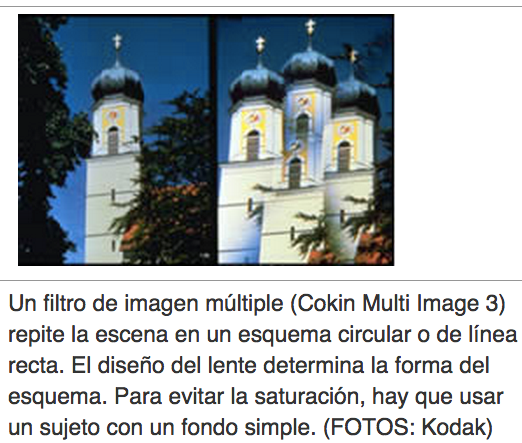
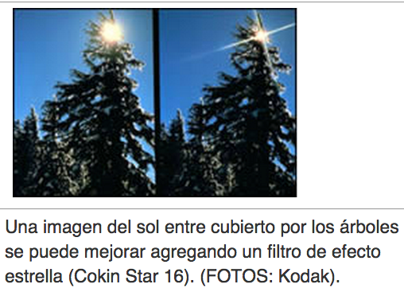
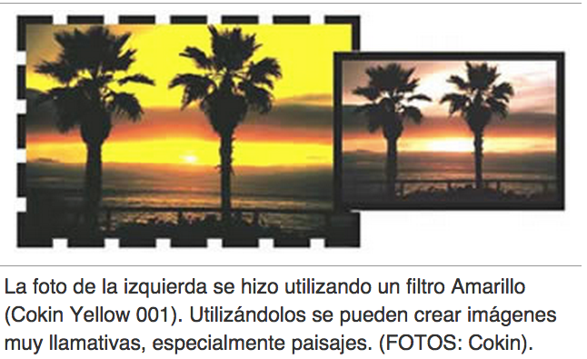

# Filtros

Los hay de dos tipos: para corrección y para lograr efectos especiales. Mientras que los primeros ayudan con la precisión de color que requiere un fotógrafo profesional, los segundos aportan un toque llamativo a escenas normales. Al utilizar filtros especiales en forma moderada, aumentan las posibilidades de control sobre la imagen y permiten obtener fotos imposibles de lograr de otra forma. Puede apreciar algunos ejemplos en el uso de filtros en el sitio Web de Cokin, uno de los mayores fabricantes de estos ([http://www.cokin.fr/gallery.html](http://www.cokin.fr/gallery.html)[.html](http://www.cokin.fr/gallery.html)).   
Veamos algunos ejemplos:

Fuente: John Hedgecoe, (2003, Enero 25), Bases de la fotografía; EDUTEKA, Edición 16, Descargado: de [http://www.eduteka.org/ComposicionFotos.ph](http://www.eduteka.org/ComposicionFotos.php)