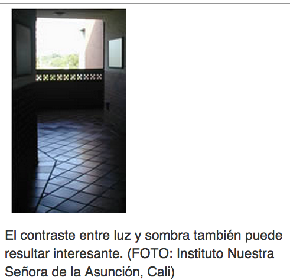

# Iluminación

En muchos casos se necesitará suficiente luz para poder enfocar o distribuir la luz de manera pareja para evitar sombras. Con el uso de “flashes” se obtiene gran profundidad; además en distancias cortas, los extremadamente cortos momentos de luz, evitan que la cámara o el movimiento del sujeto difuminen la imagen. Sin embargo, en algunos casos, el flash cambia el color de la fotografía o causa una sobre exposición por estar muy cerca del sujeto. En estos casos, lo mejor es utilizar otra fuente de iluminación. Sea creativo. Utilice cartones forrados con papel de aluminio o espejos como refractores. Si toma fotografías en el interior, pruebe diferentes lámparas domésticas. Utilizar una cámara digital permite experimentar, verificar inmediatamente los resultados y probar algo completamente diferente.

Fuente: John Hedgecoe, (2003, Enero 25), Bases de la fotografía; EDUTEKA, Edición 16, Descargado: de [http://www.eduteka.org/ComposicionFotos.ph](http://www.eduteka.org/ComposicionFotos.php)