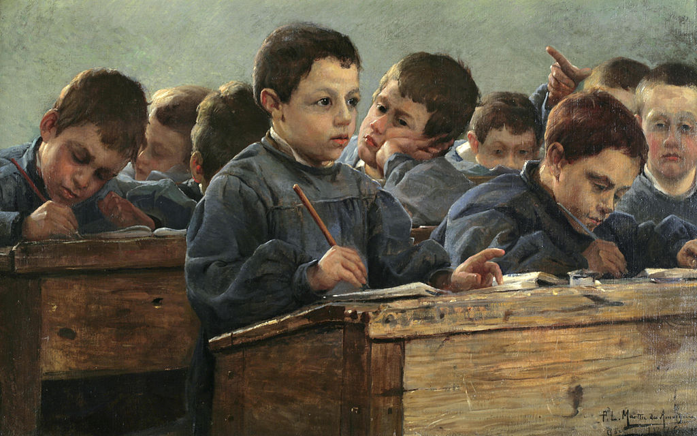

# Educación ayer y hoy

#### Por Paul Louis Martin des Amoignes (1858–1925) (Bonhams) \[Public domain\], [undefined](https://commons.wikimedia.org/wiki/File%3AP_L_Martin_des_Amoignes_In_the_classroom_1886.jpg)

Fuente: [https://commons.wikimedia.org/wiki/File:P\_L\_Martin\_des\_Amoignes\_In\_the\_classroom\_1886.jpg?uselang=es](https://commons.wikimedia.org/wiki/File:P_L_Martin_des_Amoignes_In_the_classroom_1886.jpg?uselang=es)