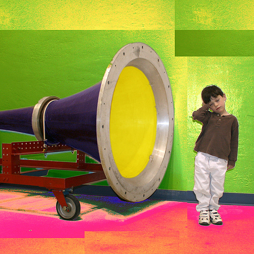

# Alfabetización audiovisual: lenguaje visual básico

Imagen:   

Esta foto cuyo autor es [https://goo.gl/k9V2Rd](https://goo.gl/k9V2Rd) está bajo una [licencia de Reconocimiento-NoComercial-CompartirIgual 4.0 Internacional de Creative Commons](http://creativecommons.org/licenses/by-nc-sa/4.0/).