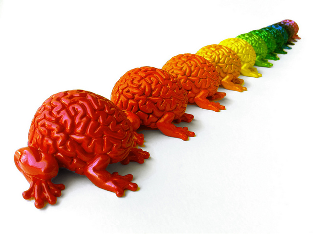

# Inteligencias Multiples

Las escuelas deben ser conscientes de las inteligencias múltiples. Todos resolvemos problemas de manera diferente. Algunos somos más matemáticos, otros más artísticos, más musicales, y así sucesivamente. En otras palabras, todos tenemos inteligencias múltiples. Estas se expresan de manera diferente en cada individuo, y todas ellas son igualmente importantes. (Howard Garner). Las escuelas deben educar para inteligencias múltiples, y, para ello, los centros deben crear un ambiente que fomente todos los tipos de inteligencias

