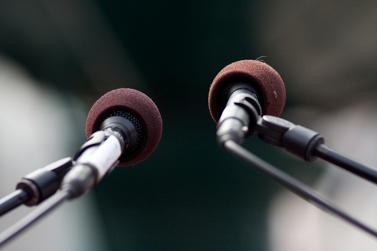

# Introducción

En la década de los ochenta, entramos en la “sociedad de la comunicación”: La explosión de lo audiovisual, la telemática e informática, la globalización de la información, los intercambios de información más complejos y rápidos conducen a profundas transformaciones donde la comunicación y el poder comunicativo de la imagen se convierten en un factor fundamental. En la sociedad mediática en la que vivimos, la información asimilada más rápidamente es aquélla que se transmite por medio de un lenguaje visual o audiovisual. La imagen se ha convertido en un bastión de la sociedad contemporánea.

Hoy podemos hablar del lenguaje de las imágenes, de una semiótica de las imágenes, de sus mensajes, de su interpretación, de la imagen como información primordial y no secundaria. 

*   ¿Qué es educar la mirada?
*   ¿Sabemos leer las imágenes?
*   ¿Somos conscientes de la importancia creciente de éstas como instrumentos de comunicación?
*   ¿El no saber interpretarlas puede considerarse analfabetismo visual?
*   ¿Qué importancia tiene en el currículo el estudio de la imágene para lograr una mayor y mejor competencia comunicativa de los estudiantes?

Éstas y otras preguntas deberemos formulárnoslas, si queremos definir el verdadero papel que la imagen tiene en los procesos comunicativos de hoy 

En un mundo cada vez más mediatizado por los medios de comunicación y nuevas tecnologías, es necesario saber descodificar adecuadamente toda la información que nos llega y luego conocer cómo utilizarla correctamente. Para ello, el objetivo fundamental de la competencia en educación audiovisual es que la ciudadanía, ya sean niños/as, adolescentes o personas adultas, sepa “leer y escribir” mensajes audiovisuales. Sólo de este modo todos los colectivos sociales podrán llegar a hacer un uso racional de los medios de comunicación audiovisual.

Como dice Len Masterman,“la Educación Audiovisual es uno de los pocos instrumentos que profesorado y alumnado tienen para empezar a desafiar la gran desigualdad de conocimiento y poder que existe entre los que fabrican la información por su propio interés y los que la consumen inocentemente como si fueran noticias o diversión” (1993).

Imagen:   Esta foto cuyo autor es [https://goo.gl/WHmRV0](https://goo.gl/WHmRV0) está bajo una [licencia de Reconocimiento-NoComercial-CompartirIgual 4.0 Internacional de Creative Commons](http://creativecommons.org/licenses/by-nc-sa/4.0/).
