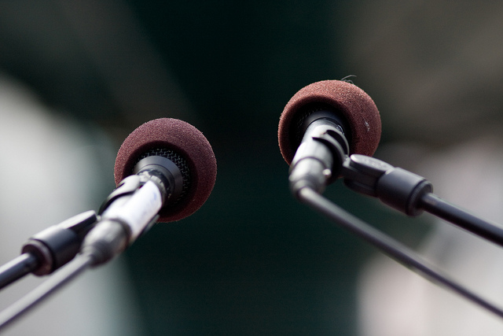

# Introducción

Pensar que el sonido dentro de una producción multimedia es un elemento más y su carácter es sólo accesorio, sería desmerecer su esencia. El sonido y la música en particular, constituyen un universo con significación propia, ya que influyen en nuestros sentidos de forma directa.

Gustavo Basso sostiene: “el sentido de la audición es complejo y delicado. Además de permitir la comunicación oral, aporta información vital sobre un entorno de 360º alrededor de la persona y no se desactiva al dormir. Se lo ha definido como el sentido alerta. Quizás nuestras capacidades musicales, que exceden mucho las necesarias para la comprensión del lenguaje, tengan que ver con esta función del oído como canal de entrada general de información ambiental.“ \[1\]  

Como se manifiesta anteriormente, el oído nos aporta información y esta atento, despierto, alerta en todo momento y aun más cuando participamos en un proceso de aprendizaje. Michel Chion opina que las producciones audiovisuales no se “ven“ sino que se audioven. Explica: ”los objetos audiovisuales dan lugar a una percepción especifica - la audiovisión- ignorada hasta ahora como tal o reducida a un simple esquema auditivo, que funciona especialmente por proyección y contaminación recíprocas de lo oído sobre lo visto.” \[2\]

Las tecnologías de la información están construidas a través de la interacción de imágenes, textos y sonidos, todos interrelacionados y complementados entre sí. El sonido aporta lo que podríamos llamar el valor añadido, Chion lo define como “ el valor expresivo e informativo con el que el sonido enriquece una imagen dada, hasta hacer creer,... que esta información o expresión se desprende de modo “natural “ de lo que se ve y está contenida en la sola imagen.” 

\[1\] BASSO, Gustavo en su ponencia “La cultura del ruido”. Encuentro Nacional de Música Acústica 1994. Libro de conferencias.

\[2\] CHION , Michel La audiovisión : Introducción a un análisis conjunto de la Imagen y el sonido. Paidos Comunicación ( 1993). 

Fuente: PROVENSAL, Analía. "El sonido en una producción multimedia" La trama de la comunicación. Vol.9. Rosario, Argentina. UNR editora 2004

Imagen:  Esta foto, cuyo autor es [https://goo.gl/Y6wCPQ](https://goo.gl/Y6wCPQ) está bajo una [licencia de Reconocimiento 4.0 Internacional de Creative Commons](http://creativecommons.org/licenses/by/4.0/).
