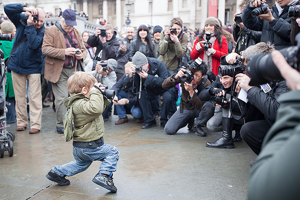

# La construcción de una mirada crítica

La evolución progresiva de las formas de comunicación actual no está siendo asimilada por igual por toda la población. Los/as más jóvenes las han conocido desde que nacieron, pero la población adulta, en su gran mayoría, se encuentra a menudo desplazada, sobre todo en lo referente a las tecnologías de la comunicación.

No obstante, hay que ser conscientes de que tanto los modos de reproducción y transmisión de los mensajes como las formas de expresión cambian continuamente. Por tanto, todos los colectivos sociales necesitan una formación continuada para educarse en una mirada crítica ante la avalancha de los _mass media_ actuales, aunque en los aspectos tecnológicos unos lo precisarán más que otros. Es imprescindible conocer el poder de los medios de comunicación como fuente de educación o deseducación.

Tal como apunta el Grupo Spectus en su libro Máscaras y espejismos (2004: 21), “los medios no son ninguna ventana abierta al mundo. Construyen ficciones y representaciones desde un punto de vista absolutamente interesado: el de los grandes emporios financieros. Se reciben sus mensajes en la intimidad, dentro del hogar y sin distancias. Pero no sólo llenan las conversaciones, la convivencia gira en torno al universo mediático y sus contenidos”.

Por otro lado, los autores también afirman que: “Detrás de cada mirada, hay un universo abierto de recuerdos, experiencias e intenciones. El estímulo acaricia la percepción, la condiciona, pero no la determina. Se completa lo percibido con lo conocido” (2004: 23). Terminan esta larga reflexión diciendo: “Considerando que la representación supone un gran simulacro al servicio del mercado, y que cada uno ve lo que ve, bien habrá que hacer una parada, una reflexión sobre el enfoque que requieren los medios, y su contraste con la realidad y nuestra experiencia sin mediaciones” (2004: 23).

De todo lo anterior se desprende, sin ninguna duda, que hace falta educar en la construcción de esta mirada crítica. Sólo así se podrá conseguir una sociedad con una buena competencia en el análisis crítico de los medios audiovisuales, en particular; o el sistema mediático, en general.

