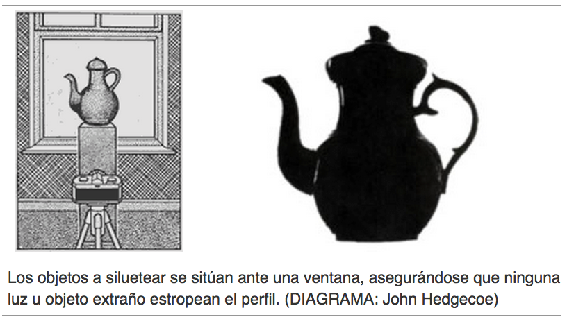
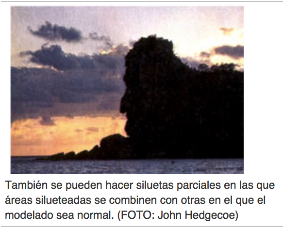

# La forma

La forma, el volumen, la textura y el color son diferentes aspectos del carácter físico de los objetos. Los estudiantes deben utilizar estos aspectos para investigar sus posibilidades como recursos de creación artística. La forma es el más importante de estos cuatro elementos ya que regularmente, para reconocer un objeto nos basta su silueta.

Fuente: John Hedgecoe, (2003, Enero 25), Bases de la fotografía; EDUTEKA, Edición 16, Descargado: de [http://www.eduteka.org/ComposicionFotos.ph](http://www.eduteka.org/ComposicionFotos.php)