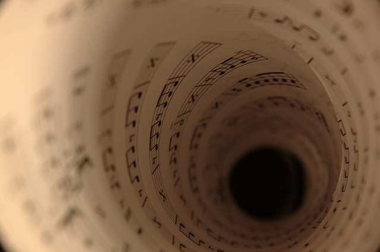

# La música

Posee valores múltiples en la producción radiofónica: sitúa en el tiempo y en el espacio, engendra climas emocionales, enfatiza el realismo de ciertos episodios y en fin, hace las veces del telón en el teatro y de los fundidos y disolvencias en el cine. En otras palabras, la música cumple varias funciones en el mensaje sonoro de ficción:  

  
_Función descriptiva_. La música evoca tiempos y lugares, nos remite a periodos históricos precisos: un vals nos instala en el Porfiriato; un corrido villista, en la Revolución mexicana; el Rock de la cárcel” interpretado por Elvis, en las postrimerías de los años cincuenta. Determinados aires musicales definen espacios sociales y culturales: la música tzotzil nos conduce a los altos de Chiapas; un danzón, al zócalo del puerto de Veracruz.  
  
_Función expresiva_. La música configura diversos climas emocionales, puede ser melancólica, vivaz, misterios, épica.  
  
_Función ambiental_. Es la música que se ejecuta dentro de una escena: la banda que ameniza un acto político, la orquesta que acompaña una boda, la música que siempre se escucha a la distancia de una feria.  
  
_Función gramatical_. Se trata de fragmentos musicales que separan una escena de otra, y por tanto, un espacio de otro o un tiempo de otro. En el vocabulario radiofónico tales separaciones son la ráfaga (fragmento brevísimo que señala una corta transición del tiempo), el puente (pasaje que indica una transición más larga) y la cortina (pasaje que separa escenas o bloques).

Fuente:  Didáctica de los medios de comunicación. (Paquete didáctico). México, SEP, 1998 

