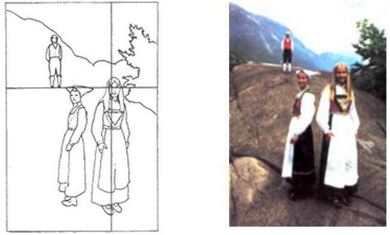

# La organización

En la fotografía, la organización es el primer elemento del lenguaje plástico-visual con el que debe familiarizarse el estudiante. La cámara, contrario a la mirada humana de una escena, reproduce sin distingos todo que aparece en el encuadre. Debido a esto, los principiantes se sorprenden cuando aparecen cosas o personas inesperadas en sus fotografías: líneas que cortan un paisaje, o en primer plano un brazo sin cuerpo o un cable eléctrico. Frecuentemente sucede esto porque el fotógrafo no repara en estos elementos durante la toma, por estar concentrado en su punto de interés.

La mirada escrutadora del ojo es algo que el fotógrafo debe imponer a la imagen mediante el enfoque selectivo o cambiando el punto de toma para que los detalles sin interés desaparezcan, se emborronen (mediante la profundidad de campo), se oculten o queden supeditados a la composición general. Para lograrlo hay que aprender a mirar como cámara y no como persona que al mirar una escena se concentra en lo que le interesa, ignorando lo demás.

La fuerza de una imagen formal radica frecuentemente en la relación de los elementos que la componen con las líneas imaginarias que la dividen horizontal y verticalmente, en tres partes iguales. Aquéllas con primer plano, distancias medias y fondo claramente discernible resultan especialmente eficaces si estas áreas forman tercios. La intersección entre dos tercios horizontal y vertical constituye una buena localización para el centro de interés. Desde aquí la vista puede recorrer toda la imagen siguiendo líneas y curvas o recorriendo centros secundarios de atención.

Los ojos de la chica constituyen el centro de atención y también gracias a las líneas de la roca y el gorro de su madre (Foto: John Hedgecoe)

Fuente: John Hedgecoe, (2003, Enero 25), Bases de la fotografía; EDUTEKA, Edición 16, Descargado: de [http://www.eduteka.org/ComposicionFotos.ph](http://www.eduteka.org/ComposicionFotos.php)