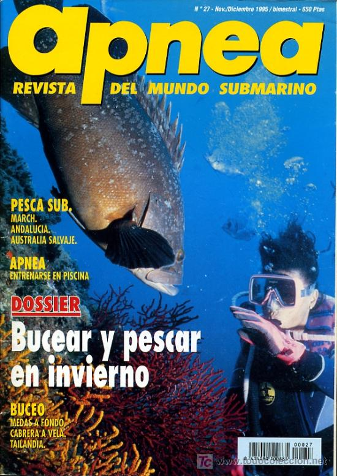

# La prensa

En los últimos años se ha producido un fenómeno de especialización de las revistas.

En España existen varias revistas para los aficionados al buceo y dos para los aficionados a las casas de muñecas. Las revistas especializadas permiten a los anunciantes llevar su mensaje a grupos poblacionales muy definidos como los aficionados a la bicicleta de montaña.

Los periódicos locales o las ediciones locales de los periódicos nacionales facilitan el llevar el mensaje a los consumidores de una localidad. Incluso los grandes periódicos de las ciudades importantes suelen tener ediciones por zonas que facilitan a los comerciantes de cada zona el comunicarse con su barrio o comunidad.