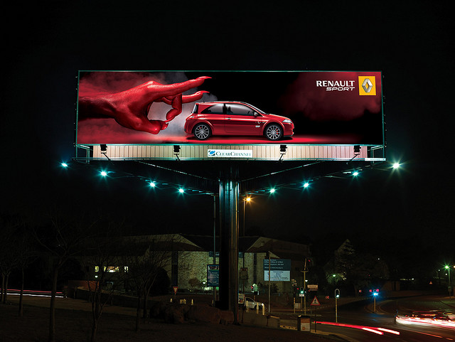

# La publicidad exterior

**La Publicidad Exterior**. Una parte importante de la publicidad es la publicidad mediante vallas publicitarias, cabinas de teléfono y en general todos los diferentes carteles, rótulos y elementos publicitarios en las calles, carreteras y espacios públicos.

