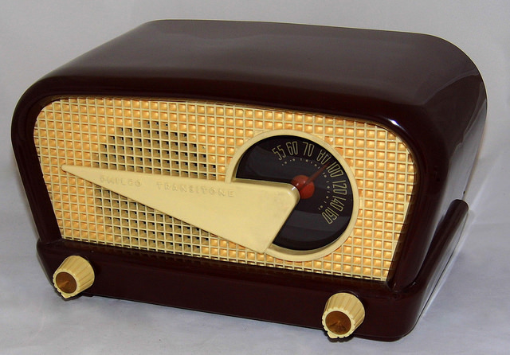

# La radio

El medio radio permite llevar el mensaje de un modo rápido y flexible. La existencia de emisoras locales permite a los comerciantes dirigir sus mensajes partiendo de presupuestos bajos a los consumidores de su zona.

En los últimos años muchas emisoras se han especializado emitiendo por ejemplo solo cierto tipo de música para jóvenes.

\[Imagen:  Esta obra cuyo autor es [https://goo.gl/o09ttF](https://goo.gl/o09ttF) está bajo una [licencia de Reconocimiento-CompartirIgual 4.0 Internacional de Creative Commons](http://creativecommons.org/licenses/by-sa/4.0/).\]
