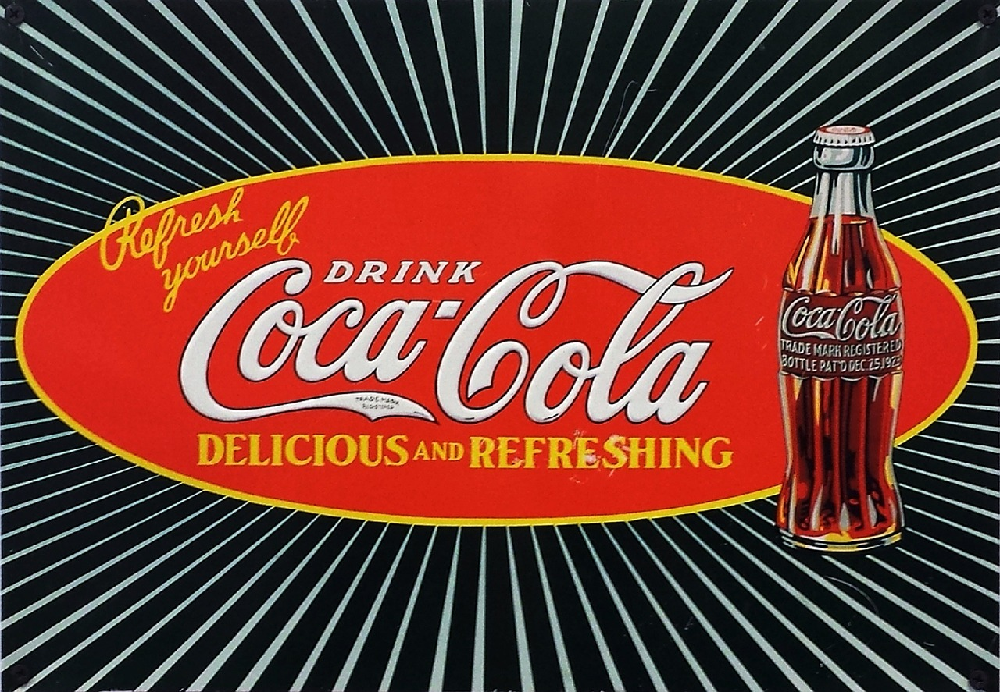

# Los anunciantes

El anunciante es en nombre de quien se realiza la publicidad. En los anuncios de Coca Cola el anunciante es la empresa Coca Cola.

Los anunciantes más típicos son las empresas. Pero también realizan publicidad y son anunciantes la organizaciones no lucrativas como la [Cruz Roja](http://www.cruzroja.es/), [Ayuda en Acción](http://www.ayudaenaccion.org/), las asociaciones y las Organizaciones Gubernamentales. Incluso las personas realizan publicidad cuando ponen un anuncio para vender su casa.

