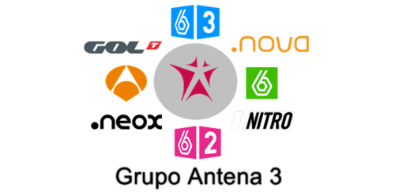

# Los medios de comunicación

**Los medios de comunicación** son los canales por los cuales se traslada el Mensaje publicitario del Emisor a los Receptores.

Cuando hablamos de medios nos referimos en general al sistema por el cual llevamos el mensaje.

La Televisión, la Prensa, la Radio, son buenos ejemplos de medios de comunicación. Por tanto, cuando en publicidad se emplea el término Medios de Comunicación en sentido estricto se refiere al conjunto de empresas que emplean una cierta tecnología como el Medio televisivo.

A un canal concreto de televisión como por ejemplo [Antena3 ](http://www.antena3.com/)se le denomina un Soporte.

****
