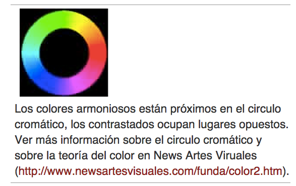

# Pensar en Blanco y Negro y en color

**PENSAR EN BLANCO Y NEGRO**  
La fotografía en blanco y negro pone de manifiesto las formas, volúmenes y detalles esenciales de cualquier sujeto al convertir el complejo juego de luces y colores en tonalidades del gris. La práctica permitirá contemplar los sujetos en términos de su equilibrio tonal y del ambiente que pretenda crear. Un tema sombrío, por ejemplo, pedirá tonos predominantemente obscuros, mientras que una textura delicada irá mejor con un contraste bajo.

**PENSAR EN COLOR**  
Una buena fotografía en color debe provocar una respuesta emocional acorde con el tema que representa, siendo su consecución cosa de gusto y buen juicio más que de normas. Ciertas combinaciones de color resultan en general armoniosas, otras son más llamativas o discordantes. En las fotografías, los colores claros parecen situarse más cerca del observador que los oscuros. Cualquier color queda determinado por los que lo rodean. Un color puro lo parecerá más contra un fondo neutro no saturado, y viceversa, un color fuerte se debilitará en presencia de otros igualmente fuertes.

Fuente: John Hedgecoe, (2003, Enero 25), Bases de la fotografía; EDUTEKA, Edición 16, Descargado: de [http://www.eduteka.org/ComposicionFotos.ph](http://www.eduteka.org/ComposicionFotos.php)