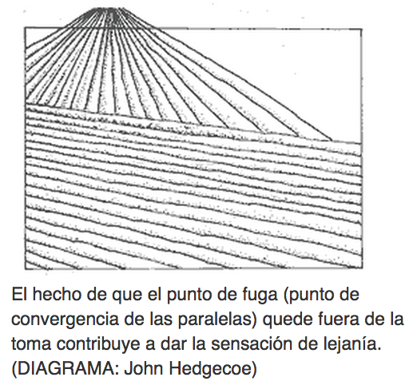
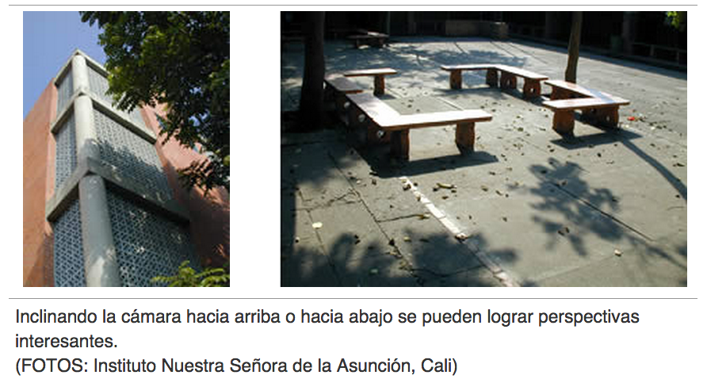

# Perspectiva

Hay ocasiones en las que con solo cambiar el ángulo de la toma se incrementa la sensación de lejanía que da la perspectiva lineal.

Fuente: John Hedgecoe, (2003, Enero 25), Bases de la fotografía; EDUTEKA, Edición 16, Descargado: de [http://www.eduteka.org/ComposicionFotos.ph](http://www.eduteka.org/ComposicionFotos.php)