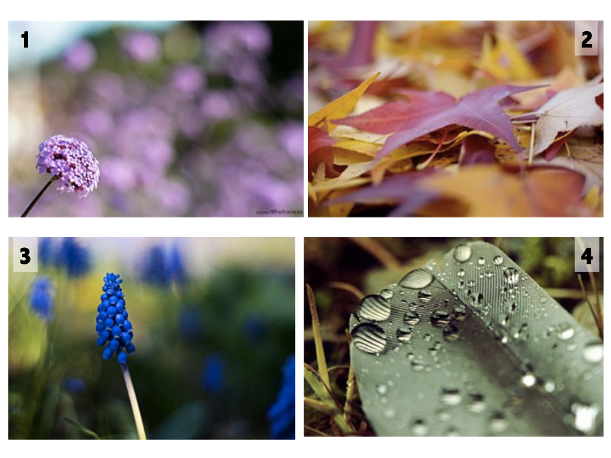

# Profundidad

La creación de la sensación de profundidad en una superficie plana es un problema legendario para pintores y dibujantes. Los principios geométricos de la perspectiva lineal, tan utilizada por estos, es inherente a casi todas las fotografías. Pero además de la perspectiva lineal puede lograrse sensación de profundidad utilizando la neblina atmosférica que hace que los objetos distantes tengan colores más claros y menor definición que los del primer plano. Por ser la neblina un fenómeno atmosférico que no siempre está presente, el enfoque selectivo es la técnica de separación de lo lejano y lo próximo más utilizada por los fotógrafos. Una gran abertura del diafragma (f2.8) producirá poca profundidad, dejando fuera de foco los objetos situados por delante y por detrás del centro de atención. Se pueden conseguir resultados diferentes con una misma imagen y  valores en la velocidad de obturación y apertura del diafragma (profundidad de campo).

La profundidad de campo es un recurso de composición fotográfica excelente, ya que influye de forma decisiva en la atención que mostramos a la hora de contemplar una fotografía.

Inconscientemente, dirigimos nuestros ojos a aquellas zonas de la imagen que se encuentran más enfocadas frente a aquellas otras que no lo están.

Esto convierte la profundidad de campo en **un arma infalible que juega a nuestro favor a la hora de hacer fotos y dirigir la atención** donde creemos que está en centro de atención de nuestra foto, reforzando el mensaje que queremos transmitir con nuestra fotografía.

Fuentes: 

*   John Hedgecoe, (2003, Enero 25), Bases de la fotografía; EDUTEKA, Edición 16, Descargado: de [http://www.eduteka.org/ComposicionFotos.ph](http://www.eduteka.org/ComposicionFotos.ph)
*   dzoom: [http://www.dzoom.org.es/profundidad-de-campo/](http://www.dzoom.org.es/profundidad-de-campo/)