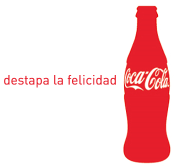

# ¿Qué es un eslogan?

Frase publicitaria corta y contundente, que resume el beneficio del producto. Suele acompañar la marca, y puede utilizarse para otros productos de la misma empresa. Habitualmente contiene el eje central de la campaña, repitiéndose en cada uno de los vehículos de difusión de la misma. El eslogan no es el titular de un anuncio, aunque pueda llegar a serlo. Se recomienda que tenga entre cuatro y seis palabras como máximo; debe ser breve, fácil de recordar e identificable con el producto y la marca. El eslogan resume el proceso publicitario; es todo lo que se quiere comunicar sobre el producto o servicio. Si el anunciante está llevando a cabo una campaña en varios medios a la vez, es importante que el eslogan que parezca en cada uno de ellos sea el mismo.

¿Qué es un eslogan? La palabra eslogan, para ponernos etimológicos y locos, proviene de dos palabras gaélicas. Estas palabras, son: “sluagh” y “ghairm”. La primera significa “multitud”, y la segunda significa “grito”. Un eslogan es un grito de guerra, una llamada a la acción.

Normalmente, el eslogan se encuentra impreso al final de la página, si el canal es la escritura. Si se trata del medio televisivo, el eslogan suele aparecer en la pantalla, a través de una sobreimpresión y generalmente también al final del anuncio, identificándose con el logotipo de la marca anunciante.

El eslogan ha de ser, antes que nada, algo exclusivo, reconocible y valorado por el consumidor.
