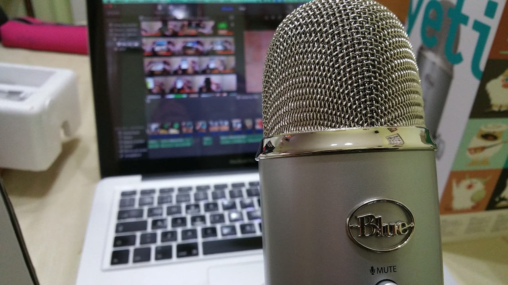

# ¿Qué son los podcast?

Podcast es un neologismo que se conformó a partir de la unión de las palabras iPod (reproductor MP3 de Apple) y Broadcast (emisión de un programa). Los Podcasts se definen como una serie de archivos de audio digital, los cuales se distribuyen en forma de episodios y pueden descargarse a un computador o a un reproductor de música, mediante sindicación ([RSS](http://www.eduteka.org/RSS.php)). La sindicación posibilita a los suscriptores enterarse cada vez que se publica en el canal un nuevo episodio.

El primer paso de este proceso consiste en grabar un archivo de audio y el formato más común para hacerlo es el MP3. Una vez se graba y edita el archivo de audio, se procede a alojarlo en un sitio especializado para publicar Podcasts. Posteriormente, se hace pública la dirección Web de la cuenta en la cual quedó alojado el archivo, para que los posibles interesados en su contenido se suscriban a ella mediante sindicación (RSS). Cada vez que alojemos un nuevo archivo (episodio) en dicha cuenta, quienes están suscritos a ella, podrán descargar y escuchar los archivos, en su ordenador o en su dispositivo móvil.

Los Podcasts, a diferencia de las emisoras de radio escolar cuyas emisiones solo tienen alcance local, abren las puertas a una audiencia global. Cualquier persona, en cualquier lugar del planeta, puede suscribirse a ellos y descargarlos automáticamente a sus computadores o dispositivos móviles, tan pronto se publica un nuevo episodio.

