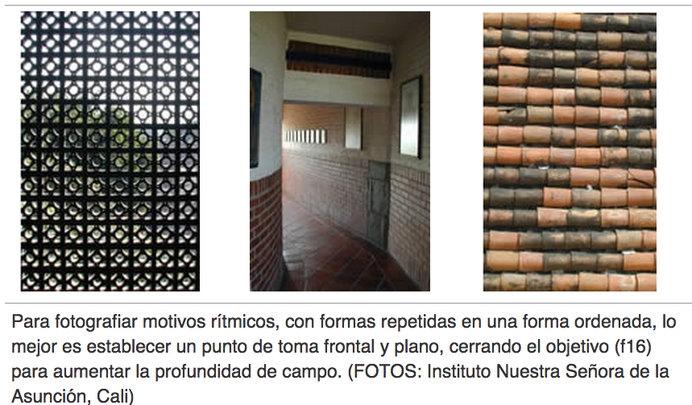

# Ritmo

Los motivos rítmicos se encuentran en cualquier parte, siendo las formas naturales fuentes particularmente abundantes de ellos. Por ejemplo motivos geométricos regulares como, la disposición de las hojas de ciertas plantas, están incluidos en formas más complejas que a su vez se repiten a mayor tamaño.

Fuente: John Hedgecoe, (2003, Enero 25), Bases de la fotografía; EDUTEKA, Edición 16, Descargado: de [http://www.eduteka.org/ComposicionFotos.ph](http://www.eduteka.org/ComposicionFotos.php)