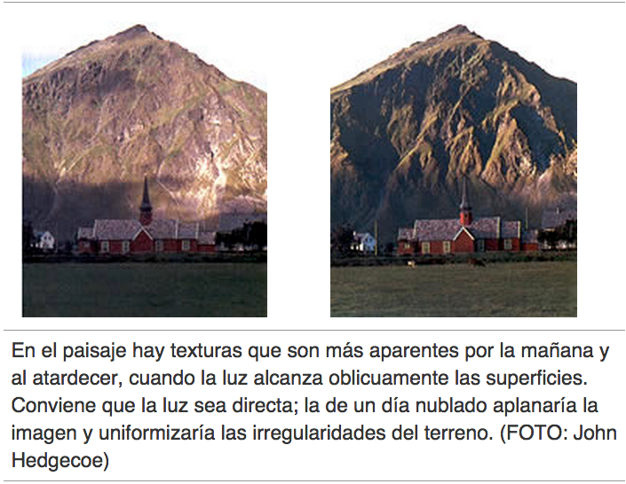

# Textura

La fotografía puede reproducir la textura de una superficie con una fidelidad tal que es fácil presentir la sensación que produciría tocarla. El resultado dependerá siempre de la iluminación. Cuando la luz oblicua resalta una textura, muchas superficies sin aparente interés quedan transformadas en temas muy decorativos. Explorar nuevos aspectos en objetos cotidianos es tratarlos como texturas: un tablón de madera, la raíz de un árbol, una hoja que muestre sus nervaduras pronunciadas, etc.

Fuente: John Hedgecoe, (2003, Enero 25), Bases de la fotografía; EDUTEKA, Edición 16, Descargado: de [http://www.eduteka.org/ComposicionFotos.ph](http://www.eduteka.org/ComposicionFotos.php)