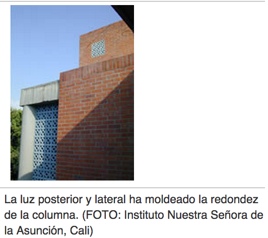

# Volumen

Lo que da a los objetos fotográficos su aspecto sólido, su modelado es sobre todo el juego de luces y sombras. La calidad y dirección de la luz son determinantes para lograrlo. La yuxtaposición acentúa los volúmenes: rígido y blando; suave y anguloso, son cualidades que adquieren mayor relevancia si se presentan juntas.

Fuente: John Hedgecoe, (2003, Enero 25), Bases de la fotografía; EDUTEKA, Edición 16, Descargado: de [http://www.eduteka.org/ComposicionFotos.ph](http://www.eduteka.org/ComposicionFotos.php)